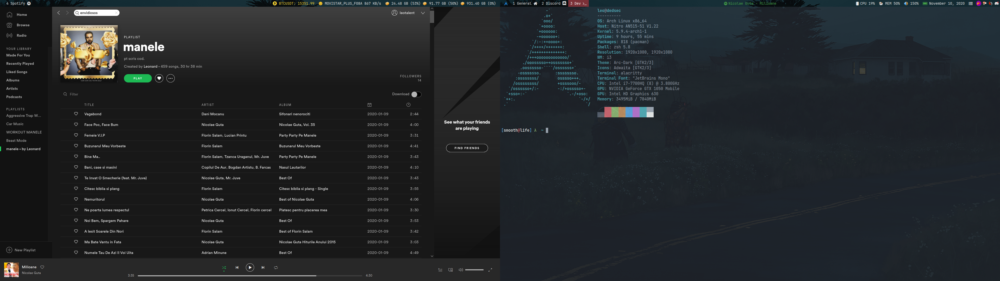
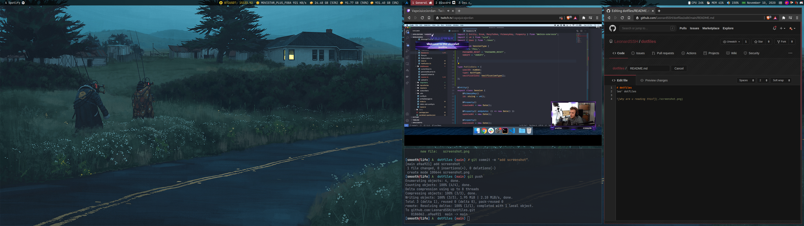

# dotfiles
leo' dotfiles

You can install what you want from here using [stow](https://www.gnu.org/software/stow/).  
If you don't know what [stow](https://www.gnu.org/software/stow/) is, do a google search, it's nice and easy to use

   
Some screenshots

  
  
  

